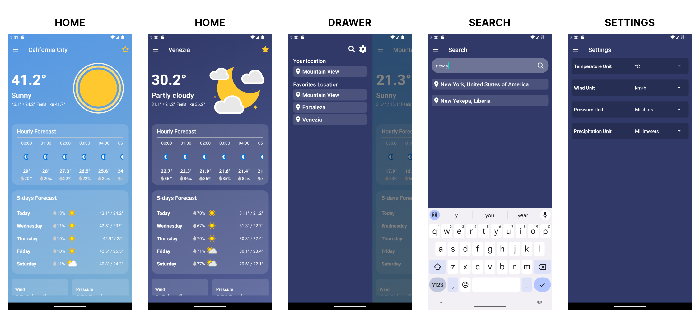

# Weather App

This Weather App is built using React Native, Expo, and TypeScript. It utilizes the WeatherAPI to fetch weather data and Expo Location for accessing the user's current location. The app supports saving favorite locations, searching for cities by name or coordinates, and dynamically updates the home screen's background and animations based on the weather and time of day.

## Preview



## Features

- **Current Weather**: Users can view the current weather for their location using Expo Location.

- **Favorite Locations**: Users can save favorite locations. Favorites are stored in AsyncStorage and synchronized with context updates.

- **City Search**: Users can search for cities by name or coordinates (latitude and longitude).

- **Dynamic Background**: The home screen background updates based on whether it's day or night in the selected city.

- **Animated Weather Conditions**: The app uses Lottie animations to represent the current weather condition dynamically.

- **Settings Screen**: Users can choose their preferred units, such as Celsius and Fahrenheit for temperature.

## Project Structure

- **src/api/:** Contains modules related to API calls (WeatherAPI).
- **src/assets/:** Contains Lottie animation files for different weather conditions.
- **src/components/:** Reusable components used throughout the app.
- **src/context/:** Contains context for managing global state.
- **src/hooks/:** Custom hooks for handling specific logic and state management (access Location Context values).
- **src/routes/:** Navigation setup for the app.
- **src/screens/:** Contains screen components for different parts of the app.
- **src/types/:** TypeScript type definitions, e.g., for WeatherAPI response types.
- **src/utils/:** Utility functions used across the app.

## Setup and Installation

1. Clone the repository:

```bash
git clone https://github.com/kelvinleandro/weather-app
cd weather-app
```

2. Install dependencies:

```bash
npm install
```

3. Run the app:

```bash
npx expo start
```

## Dependencies

- **React native**
- **Expo**
- **TypeScript**
- **WeatherAPI**
- **Expo Location**
- **AsyncStorage**
- **Lottie**

## License

This project is licensed under the MIT License. See the LICENSE file for details.

